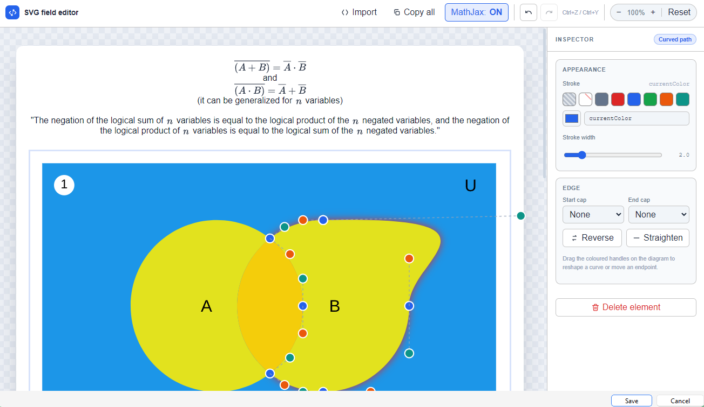

# Anki SVG editor

📥 Get the add-on here: <https://ankiweb.net/shared/info/1469315222>
🔍 Try the web demo here: <https://sammed05.github.io/anki_svg_editor/web/editor.html>

A convenient Anki add-on that adds an SVG editor to the card editor. It's accessible from a new SVG button and requires selecting the card field to edit first (Front or Back, or custom ones).

This editor allows to make quick edits to basic SVGs, even multiple ones at a time, while keeping the rest of the flashcard content intact, supporting also MathJax rendering for the card content.

The editor view is written as a standalone HTML file and can be used as a normal web application on the browser without Anki. You can import your own custom HTML/SVG code there.

